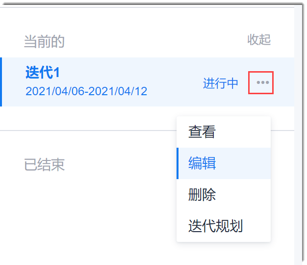

# 修改/删除迭代

当迭代的名称、开始和结束时间、迭代描述有变更时，您可以修改迭代信息。                   
当已创建的迭代不适用当前项目情况，且迭代下无工作项时，您可以删除迭代。

### 前提条件
* 已使用具有“修改迭代”或“删除迭代”权限的账号登录系统。

### 修改迭代基本信息
1. 在项目顶部菜单栏中，单击“迭代冲刺”。
2. 在左侧页面中，单击迭代后面的“ > 编辑”。                 
                      
3. 在弹出的“编辑迭代”对话框中，输入新的参数取值，单击“保存”。

### 删除迭代
1. 在项目顶部菜单栏中，单击“迭代冲刺”。
2. 在左侧页面中，单击迭代后面的“ > 删除”。
3. 在弹出的确认对话框中，单击“确定”。

