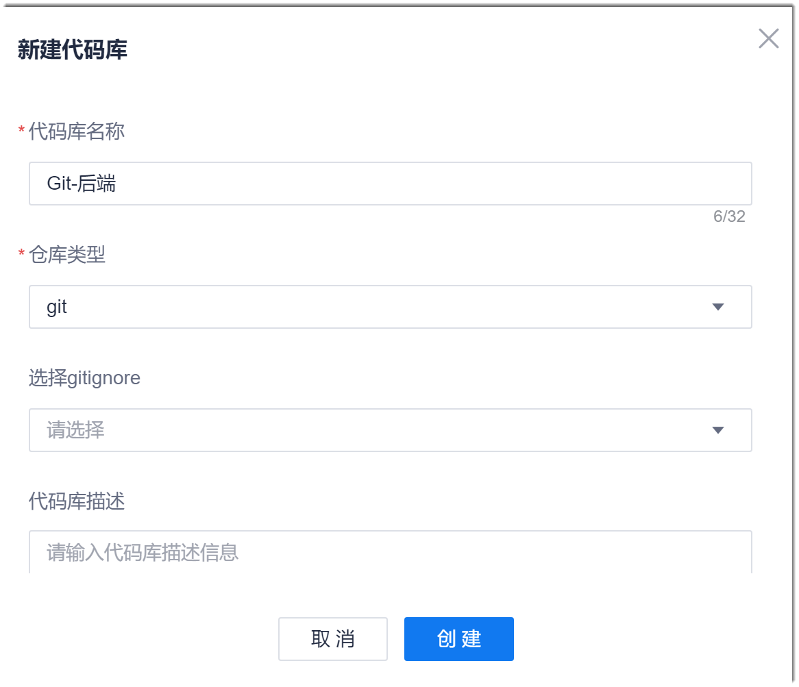
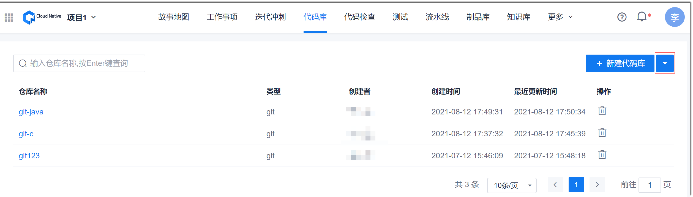

# 创建代码仓库

创建代码库有两种方式：创建空白的Git或SVN代码库、导入已有Git仓库。        
创建代码仓库后，您可以将Git或SVN仓库同步到云端系统代码库中进行统一管理。

### 前提条件
* 已在本地安装Git或SVN客户端。
* 已使用具有项目“新建代码库”权限的账号登录系统。

### 创建空白代码库
1. 在项目顶部菜单栏中，单击“代码库”。           
      界面显示代码仓库列表。        
           
2. 在右上方，单击“新建代码库”。
3. 在弹出的“新建代码库”对话框中，根据下表的描述，填写参数，单击“创建”。       
                    
      
|参数名称|说明|
|:--------- |:-------- |
|代码库名称|对于Git仓库：由1~32个字母、数字、中文、“-”、“.”、“_ ”组成，且只能由字母、数字、“_ ”开头。 对于SVN仓库：由1~32个字母、数字、“-”、“.”、“_”组成，且只能由字母、数字开头。|
|仓库类型|可以选择git和SVN。|
|选择gitignore|当“仓库类型”选择“git”时，本参数有效。 系统会根据您选择的语言生产gitignore文件。[什么是gitignore文件？](https://git-scm.com/docs/gitignore) |
|代码库描述 |最多输入128个字符。|
|创建README.md文件|自动创建README.md文件。|

创建成功后，显示新建代码库详情界面。

### 导入已有仓库      
系统当前支持导入已有的Git仓库。导入外部仓库后，原仓库中包含的分支也一并被导入。           
1. 在代码库列表界面中，单击右上角“新建代码库”右侧的“ > 导入外部仓库”。        
            
2. 在“导入外部仓库”对话框中，根据下表的描述，设置参数，单击“确定”。       
                         
    <table>
<tr>
   <th>参数名称</th>
    <th>说明</th>
</tr>
<tr>
    <td>源代码库地址</td>
    <td>输入源Git代码库的HTTPS地址。</td>
</tr>
<tr>
    <td>代码库名称</td>
    <td>自定义代码库的名称。支持字母、数字、“-” 、“_”字符，且必须以字母或数字开头。</td>
</tr>
<tr>
    <td>源仓库访问权限</td>
    <td>选择是否需要用户名/密码认证。</td>
</tr>
<tr>
    <td>源仓库用户名</td>
    <td>可以访问源仓库的用户名。</td>
</tr>
<tr>
    <td>源仓库密码</td>
    <td>“源仓库用户名”的密码。</td>
</tr>
<tr>
    <td>代码库描述</td>
    <td>最多输入128个字符。</td>
</tr>
</table>