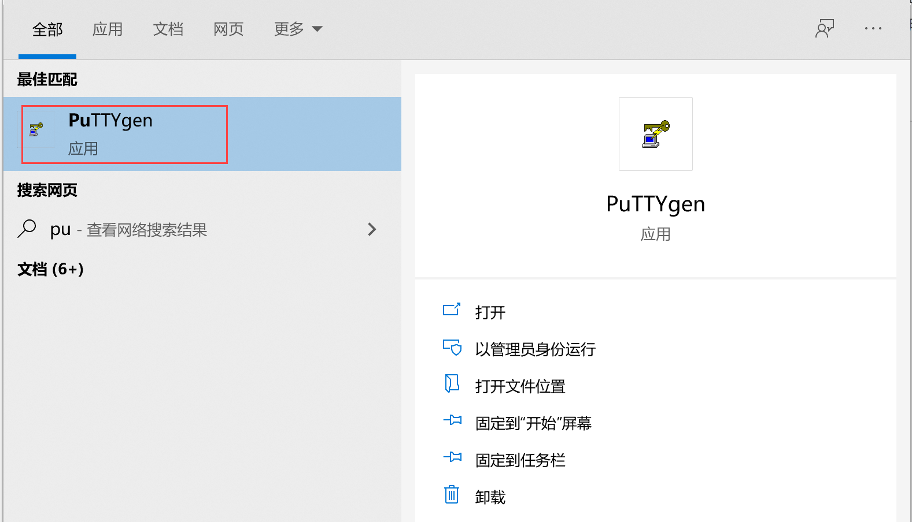
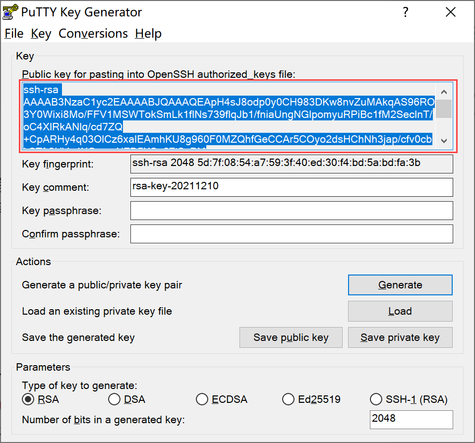
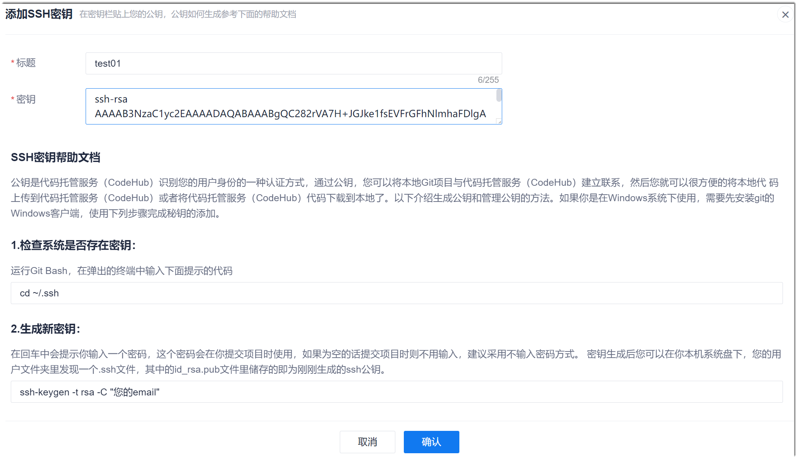
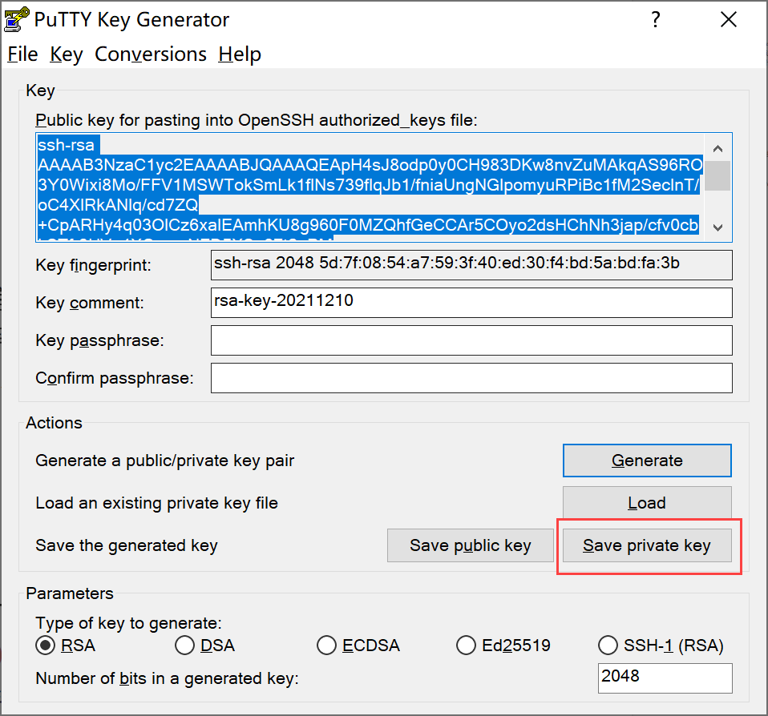
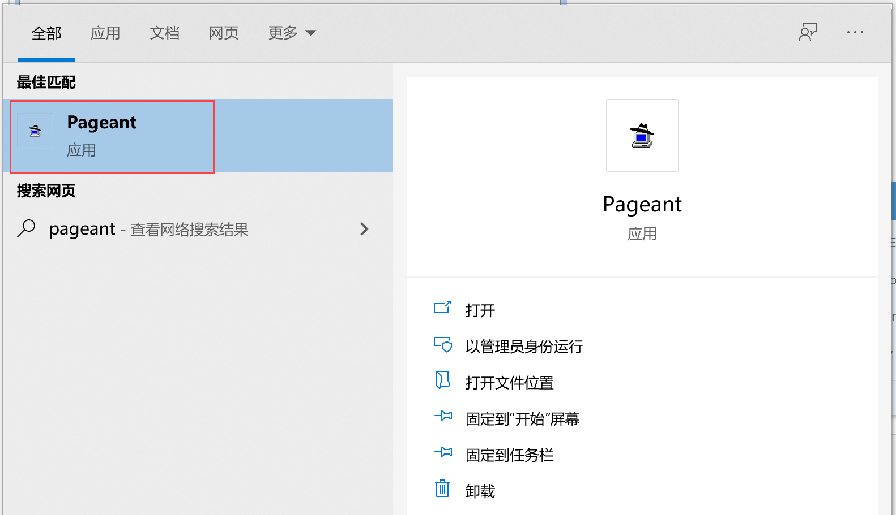
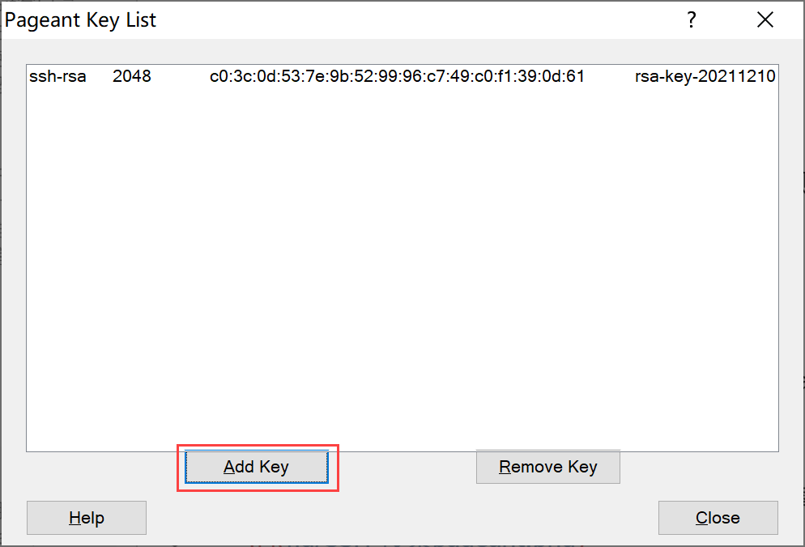
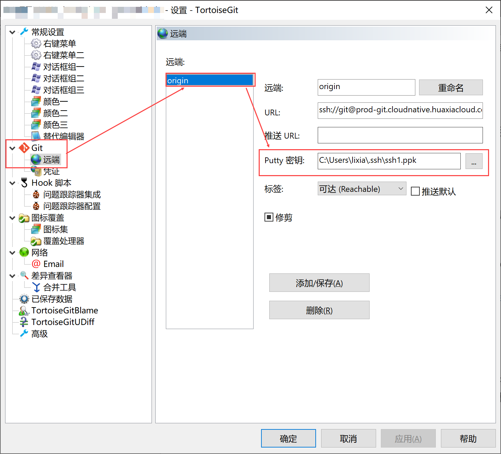
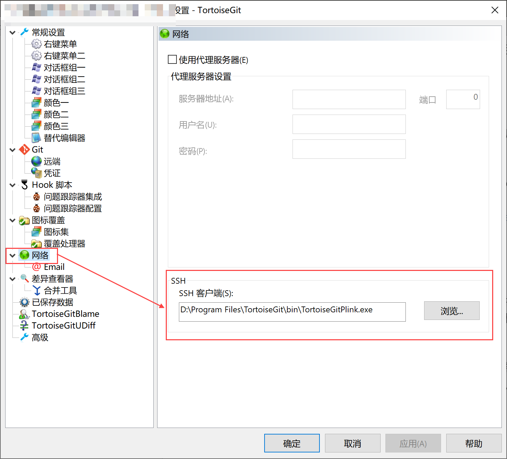

# 配置ppk密钥

ppk密钥适用于通过TortoiseGit客户端对代码库进行克隆、拉取、推送等操作。如果需要使用TortoiseGit客户端，通过SSH协议对git代码库进行操作，则需配置ppk密钥。      

### 前提条件
* 已安装TortoiseGit客户端。

### 操作步骤
1. 在本地计算机搜索栏中，输入“PuTTYgen”，选择搜索出来的PuTTYgen应用。           
                  
2. 在“PuTTY Key Generator”程序中，单击“Generate”，生成密钥。             
                  
3. 拷贝公钥的内容（暂时不关闭“PuTTY Key Generator”程序），然后将公钥添加到系统代码库的SSH密钥中。          
                      
  1. 打开系统，进入项目的“代码库”。在代码库列表页面中，单击“SSH密钥管理”。      
        
  2. 在密钥列表页面中，单击“添加SSH密钥”。         
          
  3. 在“添加SSH密钥”页面中，输入密钥标题，粘贴拷贝的公钥内容，单击“确认”。        
       

4. 生成ppk格式的私钥。              
  在“PuTTY Key Generator”程序中，单击“Save private key”。然后保存到本地计算机中。              
                      
5. 在本地计算机搜索栏中输入“pageant”，选择搜索出来的“Pageant”程序。                 
                   
    程序启动后将自动停靠在任务栏中，图标显示为。左键双击该图标，弹出“Pageant key list”对话框。             
6. 单击“Add Key”，选择保存下来的ppk格式的私钥。                    
                
7. 在本地git代码库中，加载Putty密钥。                   
  右键单击本地git代码库，选择“TortoiseGit > 设置”。在对话框中，选择“Git > 远端 > origin”，然后在“Putty密钥”中选择保存下来的ppk格式的私钥，单击“应用”。              
                    
8. 在TortoiseGit设置对话框中，选择“网络“，然后在“SSH客户端”中选择TortoiseGit的安装目录下bin文件夹中的TortoiseGitPlink.exe程序。单击“确定”。           
                     

至此，ppk密钥配置完成，您可以使用TortoiseGit客户端，通过SSH协议对Git客户端进行操作。
        

