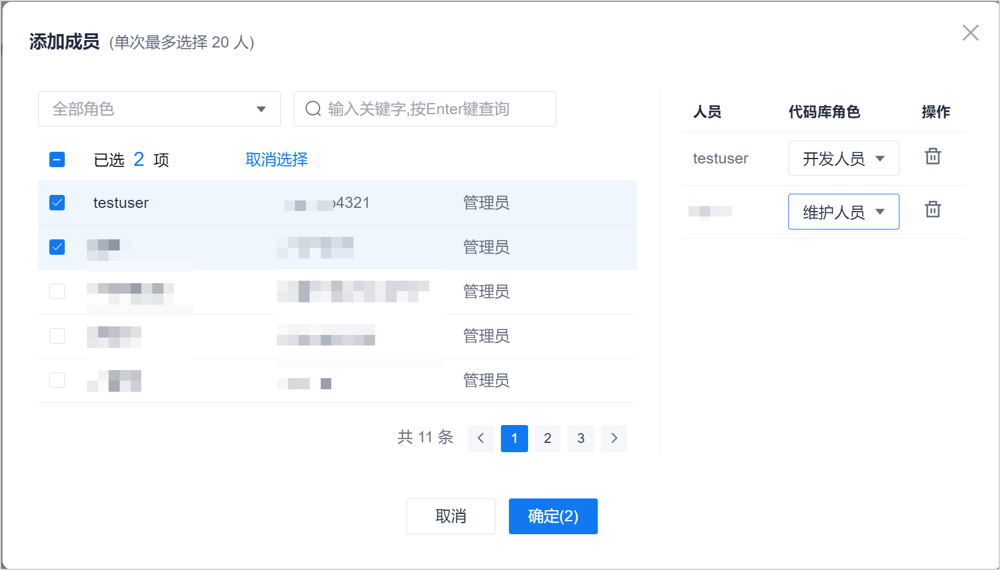

# 管理代码库成员

代码库成员首先应该是项目成员。每个代码库分别管理自己的成员。您也可以赋予代码库成员在仓库中的角色，从而使仓库成员具有对应特定的权限。

### 前提条件
* 已使用具备代码库“成员管理”权限，且已成为代码库成员的账号登录系统。
* 已创建代码库。

### 背景信息
代码库的成员可以添加项目的某个角色的所有成员，也可以单独添加某个成员。
Git仓库和SVN仓库的成员角色及其权限分别如下表所示。

|仓库类型 |角色|具备权限|
|:--------- |:-------- |:----- |
|Git仓库|维护人员|具有保护分支的提交和合并权限。| 
|Git仓库|开发人员|可以在保护分支中设置是否具有保护分支的相关操作权限。|
|SVN仓库|开发人员|SVN仓库自带功能的所有操作权限。| 
|SVN仓库|只读人员|SVN仓库自带功能的浏览权限。|

### 添加成员并赋予权限

Git仓库和SVN仓库的成员、权限操作步骤类似，以下以添加Git仓库成员为例进行介绍。

1. 单击仓库名称，进入仓库详情界面。
2. 单击“成员管理”页签。          
     界面显示仓库中的成员列表。           
     
3. 在列表右上方，单击“添加用户”。
4. 在“添加用户”对话框中，选择“角色”或“成员”页签，选中对应的角色或成员，然后设置成员在代码库中的角色，单击“确定”。    
    选择“角色”页签，表示该角色中的所有成员均加入到代码库中；选择“成员”页签，表示该成员加入到代码库中。         
              

添加成功后，新添加的成员显示在仓库成员列表中。

### 编辑成员信息
您可以修改成员的角色。       
在仓库成员列表中，单击成员后面的，修改成员角色。

### 删除成员      
在仓库成员列表中，单击成员后面的，删除成员。

