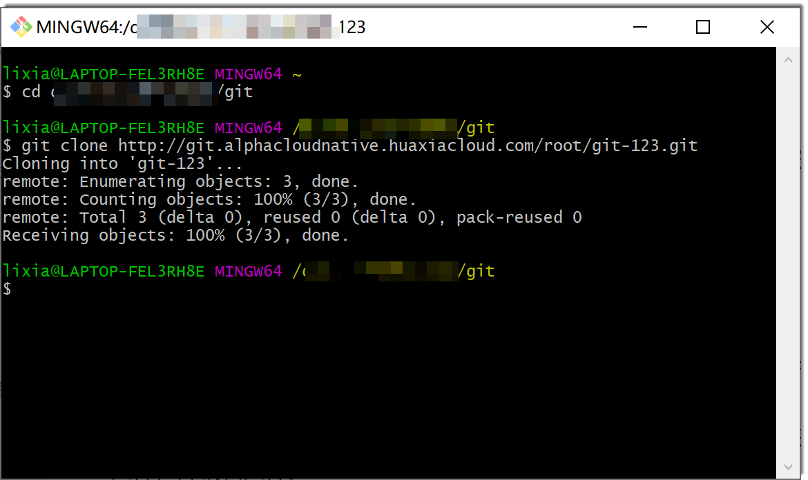
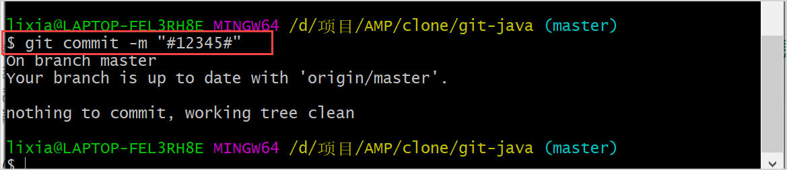

# 通过Git Bash/Linux Git/mac Git客户端

Windows Git Bash客户端、Linux Git客户端和mac Git客户端在开发并比较代码过程中的命令基本一致。以下以Windows Git Bash客户端为例进行介绍。

### 前提条件
* 已创建代码库。
* 已安装对应的Git客户端。
* 登录账号已加入代码库成员。
* 如果使用SSH协议克隆代码，请先[配置SSH密钥](9.4.0-set-ssh.md)。

### 操作步骤
1. 克隆代码库。
  1. 在代码库详情页面，单击右上方的“克隆”。
  2. 在地址对话框中，单击克隆协议后面的“复制”，复制仓库链接。              
  3. 将代码库克隆到本地。
  打开Git Bash客户端，进入本地的相应目录下，执行以下命令，将代码库克隆下来。
```
    $ git clone <克隆链接>
```
    
    

  4. （可选）如果您是第一次使用git克隆仓库，且使用HTTP/HTTPS协议，则需要验证认证信息。                      
    在弹出的用户名、密码对话框中，输入已加入代码库“维护人员”或“开发人员”的账号、密码，单击“确定”。
> [!NOTE]
> 客户端在使用**git clone**命令克隆代码仓库时失败，请检查账号密码是否有误，且是否在代码库成员中。
     
     
 
2. 新建分支。                
     进入到代码库目录，执行以下命令行创建一个新的分支，并将当前分支切换到新建分支。例如，新建并切换到“feature01”分支。
```
    $ git checkout -b <分支名称>
```
    

3. 在分支中编写代码。            
     编写代码可以在新文件中编写，也可以修改原文件编写。以下以在新文件中编写为例。             
     如果您使用Window操作系统，也可以直接在代码库目录中创建文件夹和文件，并编辑文件。              
     以下以通过命令新建文件夹和文件为例进行介绍。
```
    # 查看当前目录的内容
    $ ls
    # 新建文件夹，例如“newfolder”
    $ mkdir newfolder
    # 进入目录，例如，进入“newfolder”目录
    $ cd newfolder
    # 新建名为“test.txt”的文件
    $ touch test.txt
    # 新建并打开名为“test.txt”的文件
    $ vi test.txt
    # 按下键盘的“i”键，进入文件编辑模式
    # 在文件中编写内容
    # 编写完成后，按下键盘的“Esc”键，并输入“:wq!”，回车，保存并关闭文件
```

4. 提交文件到本地仓库。
  1. 返回到本地代码库目录，并将修改内容提交到本地仓库暂存区。
```
    # 返回上级目录
    $ cd ..
    # (本命令与下一条命令任选一个方式）提交本目录下的所有修改到暂存区
    $ git add .
    # 提交本目录下的某个文件到暂存区，例如提交“test.txt”文件
    $ git add test.txt
```
> [!NOTE]
> **git status**命令可以查询当前本地仓库的状态。您可以在需要的时候执行命令查看，后续不再赘述。

  2. 将暂存区的内容commit到本地仓库。
```
    $ git commit -m "<本次commit的备注信息>"
```
                   

   如果想要将此次提交关联到工作项，则在备注信息中以”#工作项编号#“的格式进行提交。在备注信息中写入工作项编号后，您仍然可以写入其它信息。例如，工作项编号为“12345”，则提交代码时执行如下命令：
```
$ git commit -m "#12345#"
```
                     

  关联成功后，在工作项详情的“关联 > 代码提交记录”中显示提交记录。         
                  
  单击提交记录的提交号，可以查看该提交的详情。        
                  
  如果您具有代码库的“在线浏览代码”权限，则可以单击文件名称，查看本次变更的内容。                       
                             

5. 推送文件到远端仓库的当前分支。
```
    $ git push origin <当前分支名称>
```
    
    

6. 合并分支。            
    以下以当前分支为“feature01”分支，目标分支为“master”分支为例。         
  1. 将当前分支切换到目标分支，
```
    $ git checkout master
```
  2. 将目标分支的内容更新到最新版本。
```
    $ git pull
```
  3. 将“feature01”分支中的内容合并到“master”分支中。
```
    $ git merge feature01
```
  4. 将“master”分支中更新的内容提交到远端仓库。
```
    # 提交本目录下的所有修改到暂存区
    $ git add .
    # 将本地仓库的内容推送到远端仓库
    $ git push origin master
```
      
      

本地修改的内容已推送到远端仓库，并合并到主干中。您可以打开系统的代码库查看。


