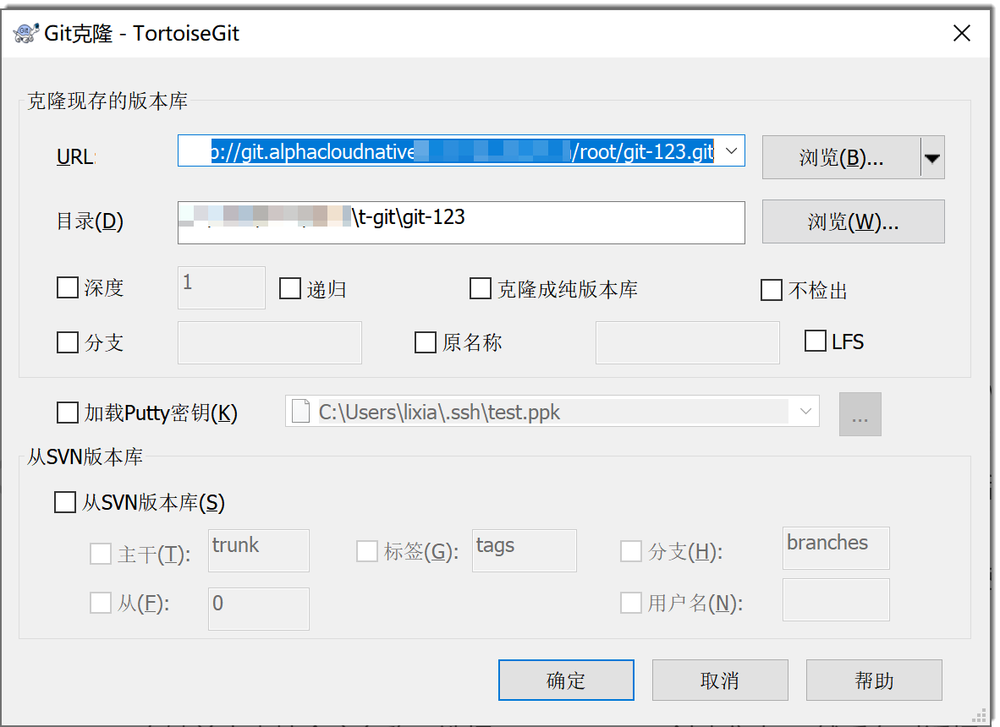
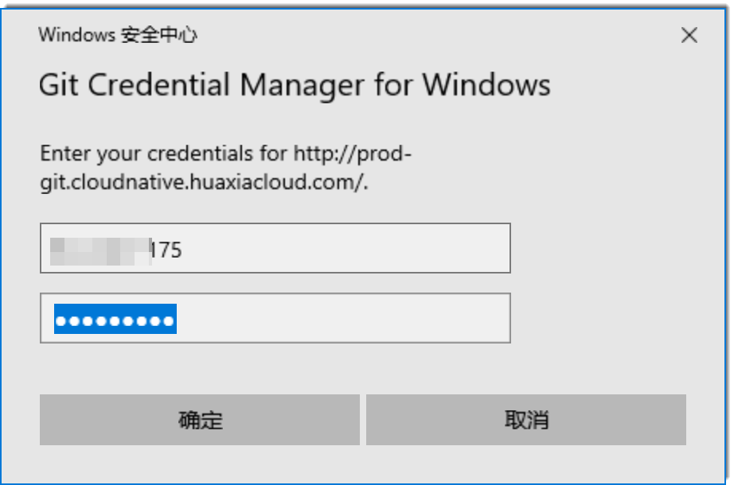
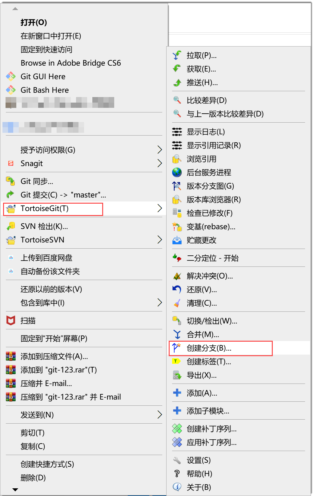
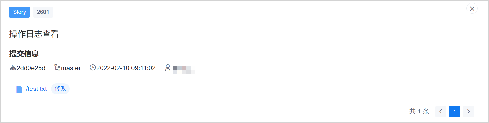

# 通过TortoiseGit客户端

介绍通过Windows操作系统下的TortoiseGit客户端如何开发并提交代码到远端仓库。
### 前提条件
* 已创建代码库。
* 已安装对应的TortoiseGit客户端。
* 登录账号已加入代码成员。     
* 如果使用SSH协议克隆代码，请先[配置SSH的ppk密钥](9.4.0.2-gen-ppk-key.md)。

### 操作步骤

1. 在代码库详情页面，单击右上方的“克隆”。
2. 在地址对话框中，单击克隆协议后面的“复制”，复制仓库链接。          
            
   
1. 根据克隆协议选择一种方式，将仓库克隆到本地。            
  * **HTTP/HTTPS协议**            
    1. 进入本地相应目录下，单击鼠标右键，选择“Git克隆”。      
    2. 在弹出的窗口中，将复制的HTTPS地址粘贴到URL输入框中，然后单击“确定”。                  
                     
        如果您是第一次克隆，TortoiseGit客户端会弹出对话框，要求输入用户名和密码。            
                    
    5. 在用户名密码对话框中，输入代码库“维护人员”或“开发人员”角色的账号和密码，单击“确定”。         
      如果界面提示“成功”，表示仓库克隆成功。   
  * **SSH协议**       
    1. 进入本地相应目录下，单击鼠标右键，选择“Git克隆”。      
    2. 在弹出的窗口中，将复制的SSH地址粘贴到URL输入框中，勾选“加载Putty密钥”，并选择在配置ppk密钥时保存下来的私钥文件，然后单击“确定”。                  
                  
      如果界面提示“成功”，表示仓库克隆成功。           
2. 新建分支。         
  1. 右键单击本地仓库名称，选择“TortoiseGit > 创建分支”。
           
  2. 在对话框中输入分支名称、分支基线，单击“确定”。          
     如果需要将当前分支切换到新建的分支，在上面的对话框中勾选“切换到新分支”。              
     
     
3. 在分支中编写代码。            
     编写代码可以在新文件中编写，也可以修改原文件编写。以下以在新文件中编写为例。            
     进入仓库目录，新建一个“newFile.txt”文件，并在里面书写一行文字。            
     
     
4. 提交文件到本地仓库。
  1. 在本地仓库目录下，右键单击空白处，选择“Git（提交） > _分支名称_”。             
                  
  2. 在对话框中，填写本次提交的日志信息、勾选“设置作者”、在变更的文件列表中选择要进行提交的文件，单击“提交”。               
                  
       如果想要将此次提交关联到工作项，则在“日志信息”中以”#工作项编号#“的格式进行提交。在日志信息中写入工作项编号后，您仍然可以写入其它信息。例如，工作项编号为“12345”，则提交代码时在日志信息中填写如下内容：
                           
    关联成功后，在工作项详情的“关联 > 代码提交记录”中显示提交记录。         
                    
    单击提交记录的提交号，可以查看该提交的详情。        
                    
    如果您具有代码库的“在线浏览代码”权限，则可以单击文件名称，查看本次变更的内容。                       
                               
       
5. 推送文件到远端仓库。            
 1. 在仓库目录下，右键单击空白处，选择“TortoiseGit > 推送”。           
                
 2. 在弹出的窗口中，对于**HTTP/HTTPS**协议，**去勾选**“自动加载Putty密钥”，对于**SSH**协议，**勾选**“自动加载Putty密钥”，然后单击“确定”。           
      
      
6. 合并分支。           
     以下以将“develop”分支的内容合并到“master”分支为例。          
  1. 将分支切换到目标分支，即“master”分支。           
    在本地仓库目录的空白处单击右键，选择“Tortoisegit > 切换/检出”。然后在对话框中，选择“切换到 > 分支”为“master”。         
                   
  2. 将目标分支的内容更新到最新版本。         
    在本地仓库目录的空白处单击右键，选择“Tortoisegit > 拉取”。然后在对话框中，**去勾选**“自动加载Putty密钥”（适用于**HTTP/HTTPS**协议)，或者**勾选**“自动加载Putty密钥”（适用于**SSH**协议)，单击“确定”。           
                    
  3. 将“develop”分支合并到“master”分支。           
    在本地仓库目录的空白处单击右键，选择“Tortoisegit > 合并”。然后在对话框中，设置“从 > 分支”为需要合并的分支，即“develop”分支。          
                    
  4. 将“master”分支的内容推送到远端仓库。           
    在本地仓库目录的空白处单击右键，选择“Tortoisegit > 推送”。然后在对话框中，设置推送的分支，**去勾选**“自动加载Putty密钥”（适用于**HTTP/HTTPS**协议)，或者**勾选**“自动加载Putty密钥”（适用于**SSH**协议)，单击“确定”。          
           
         
本地修改的内容已推送到远端仓库，并合并到主干中。您可以打开系统的代码库查看。

