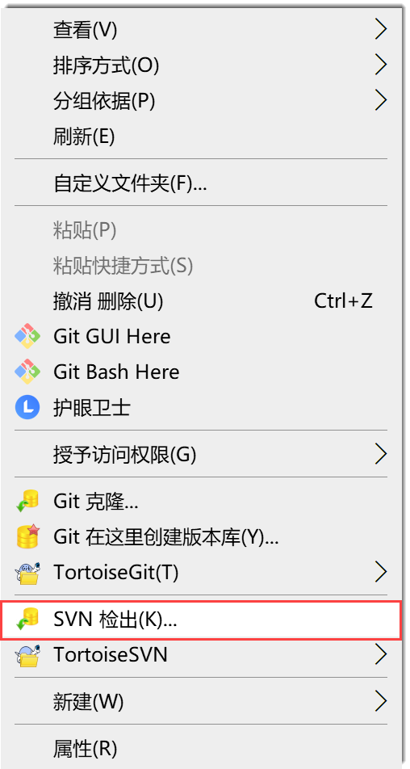
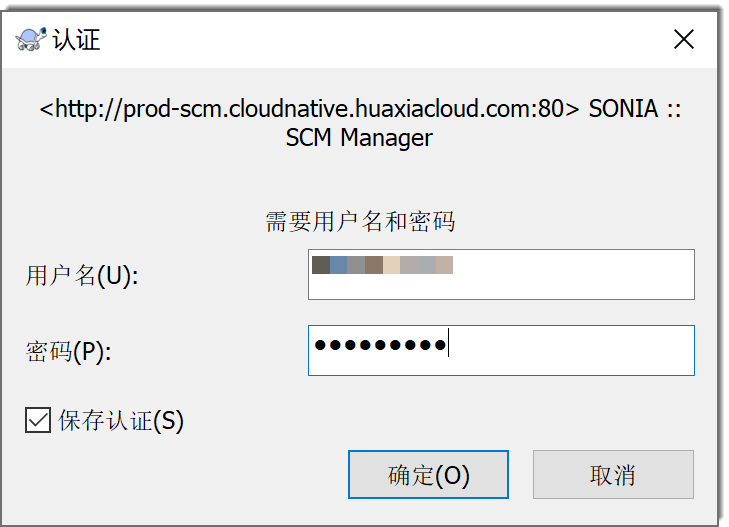

# 开发并提交代码（SVN仓库）

SVN仓库通过TortoiseSVN客户端在本地进行操作。

### 前提条件
* 已创建代码库。
* 已安装对应的SVN客户端。
* 登录账号已作为“开发人员”加入代码库成员中。

### 背景信息           
SVN的标准目录结构如下所示：
* trunk：主干开发目录。
* branches：分支开发目录。可根据分支类型创建多个分支。分支类型举例：版本发布维护分支、新特性开发分支、缺陷修复分支等等。      
在SVN仓库中管理代码的操作流程如下图所示。      

### 操作步骤
1. 克隆仓库。
  1. 在代码库列表中，单击SVN类型的代码仓库，进入代码仓库详情界面。
  2. 单击“代码”页签，然后在右上角单击“克隆”。
  3. 在按钮下方显示的对话框中，单击“复制”，复制仓库地址。             
            
  4. 进入本地存放代码仓库的目录，右键单击空白处，选择“SVN检出”。              
                       
  5. 在“检出”对话框中，将刚刚复制的代码仓库地址粘贴到“版本库URL”中，其它参数保持默认值，单击“确定”。              
                    
  6. 在弹出的“认证”对话框中，输入具有该仓库操作权限的系统账号和密码，单击“确定”。            
                       
      仓库成功克隆到本地后，目录中显示名称为仓库名称的文件夹。
      
2. 新建分支。
  1. 右键单击“trunk”，选择“TortoiseSVN > 分支/标记”。              
       
       
  2. 在创建分支对话框中，设置分支路径和复制的版本，单击“确定”。            
      所有的分支一般放到与“trunk”平级的文件夹“branches”中管理。               
         
         
  3. 在复制对话框中，待复制完成后，单击“确定”。                
         新建的分支直接创建到远端仓库，您可以在远端仓库中查看。
         
  4. 在本地代码库目录的空白处单击右键，选择“SVN更新”，将新建的分支检出到本地。
      
3. 在分支中编写代码。             
     在本地编写文件并保存。             
4. 将本地修改提交到远端仓库。
  1. 在修改所在的文件夹中，单击右键，选择“SVN提交”。          
    
    
  2. 在提交对话框中，输入提交说明，勾选需要提交的文件，单击“确定”。               
                
      如果想要将此次提交关联到工作项，则在“信息”中以”#工作项编号#“的格式进行提交。在信息中写入工作项编号后，您仍然可以写入其它信息。例如，工作项编号为“12345”，则提交代码时在日志信息中填写如下内容：
                           
     关联成功后，在工作项详情的“关联 > 代码提交记录”中显示提交记录。         
                     
     单击提交记录的提交号，可以查看该提交的详情。        
                     
     如果您具有代码库的“在线浏览代码”权限，则可以单击文件名称，查看文件的详细内容。                       
                               
      
  3. 在提交完成的提示框中，单击“确定”。         
5. 将分支的内容合并到主干。
  1. 将主干更新到最新版本。               
         在本地仓库目录中，右键单击“trunk”，选择“SVN 更新”。              
  2. 右键单击“trunk”，选择“TortoiseSVN > 合并”。
  3. 在合并对话框中，选择“合并类型”为“合并一个版本范围”，单击“下一步”。             
      
      
  4. 选择要合并的分支和合并的范围，单击“下一步”。            
     
     
  5. 设置合并的相关参数，单击“合并”。               
        为确保合并成功，您可以先单击“测试合并”，测试是否能合并成功。如果测试不成功，可以根据界面提示解决问题。
        
  6. 将合并入主干的内容，提交到远端仓库。              
        在本地仓库目录中，右键单击“trunk”，选择“SVN 提交”。

