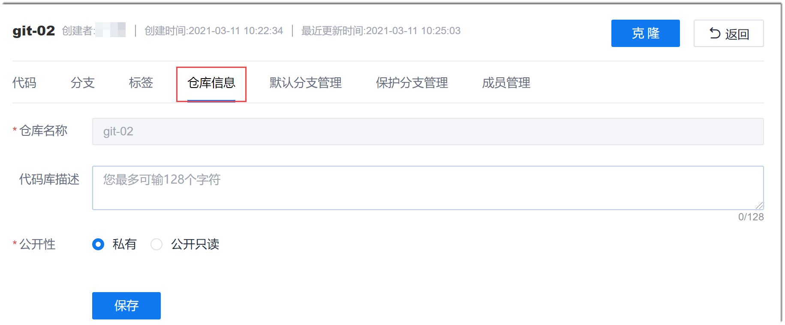

# 修改代码仓库信息（Git仓库）

当代码仓库为Git仓库时，您可以修改代码仓库的描述信息和公开性。

### 前提条件
* 已创建Git仓库。
* 已使用具有代码库“代码库基础设置”权限，且已成为代码库成员的账号登录系统。

### 操作步骤
1. 在代码仓库列表中，单击Git仓库名称，进入代码仓库详细信息界面。
    
2. 在代码仓库详细信息界面中，单击“仓库信息”页签。
  
  
3. 输入代码库描述，选择“公开性”，单击“保存”。
     
     其中，“私有”表示只有代码仓库成员才能访问；“公开只读”表示非代码仓库成员的项目成员可以以只读方式访问代码仓库。
